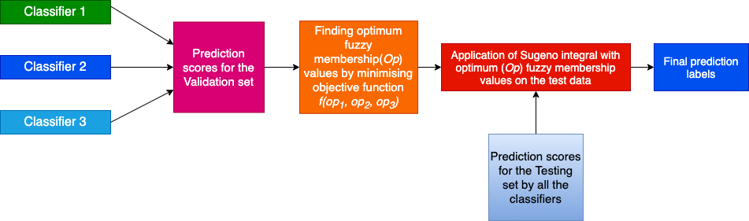
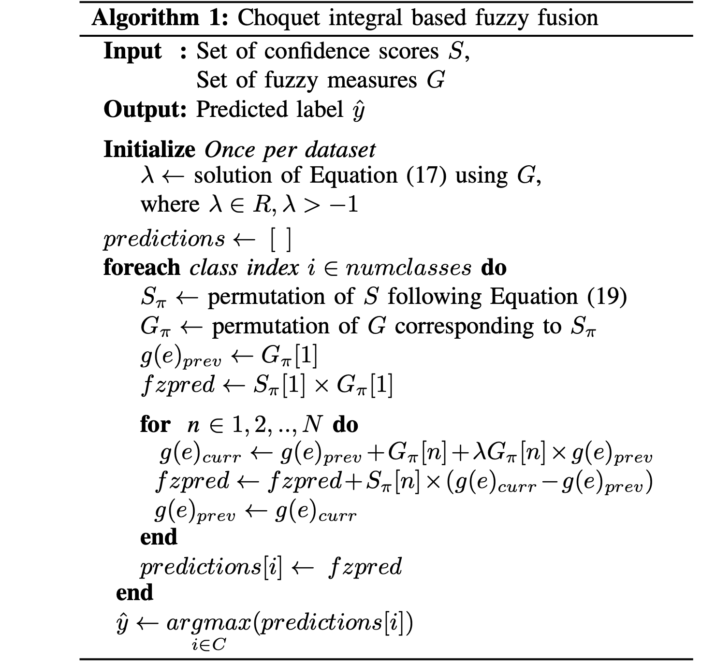
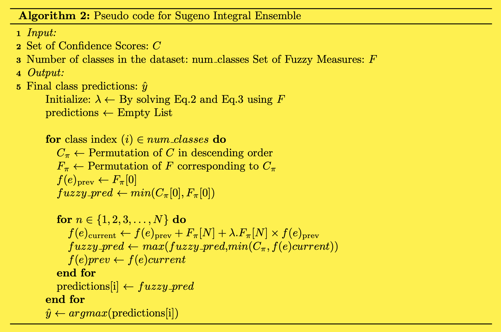

# Chest Xray Diagnoser
The page has been published at https://subro608.github.io/Final-chest-xray-deploy/index.html.
The COVID-19 outbreak has resulted in a global pandemic and led to more than a million deaths todate. COVID-19  early  detection  is  essential  for  its  mitigation  by  controlling  its  spread  from  infectedpatients  in  communities  through  quarantine.   Although  vaccination  has  started,  it  will  take  time  toreach everyone, especially in developing nations, and computer scientists are striving to come up withcompetent  methods  using  image  analysis. In this work we use three CNN models trained from scratch to detect Covid-19 patients from chest Xray images. THe predictions from the three models are then combined using Sugeno fuzzy integral method and Choquet fuzzy integral method. For using the fuzzy integral based ensemble methods we have to determine the fuzzy measure values. For this we have used Optimization algorithms on the validation dataset to get the highest accuracy score by varying the values of the fuzzy measure values. As discussed in the above the determination of fuzzy measure values for Sugeno Fuzzy integral method is shown in  .

Aggregation refers to the process of collecting performance scores of each classifier intoa single global score.  The function that is used to combine the scores into a single global score is knownas aggregation operator. Normally  as  the  aggregation  operator,  we  have  weighted  average  or  quasi  arithmetic  means  butin  our  case  it  is  the  Choquet and Sugeno fuzzy  integral  operator. The advantage of using them is tha they  harnesses  the  degree  of  uncertainty  that  is  present  in  the  decision  scores  that  we  get  as  additional information during the fusion of classifiers which is absent in normal ensembling methods. So the end result is the generalization of aggregation operators on a set of confidence scores which are known as fuzzy measures.  These fuzzy measures are weighted values given to each classifier.
The pseudocode for Choquet Fuzzy integral method is 

And the pseudocode for Sugeno Fuzzy integral method is 
